# What is Activation Function?
```
It’s just a thing function that you use to get the output of node. 
It is also known as Transfer Function.
```

# Why we use Activation functions with Neural Networks?
```
It is used to determine the output of neural network like yes or no. 
It maps the resulting values in between 0 to 1 or -1 to 1 etc. (depending upon the function).
```

# Types of Activation Functions

```
    1.Linear Activation Function
    2.Non-linear Activation Functions
```
```
Linear or Identity Activation Function
    Equation : f(x) = x
    Range : (-infinity to infinity)
    
Non-linear Activation Function
    Sigmoid or Logistic Activation Function
    Tanh or hyperbolic tangent Activation Function
    ReLU (Rectified Linear Unit) Activation Function

```


---
# Sigmoid Activation Function
```
 It transforms any value in the domain (-infinite to infinite) to a number between 0 and 1.
```
Equatuion of Sigmoid function:

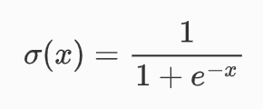

Derrivative of Sigmoid Function:
```
Range is [0, 0.25]
```
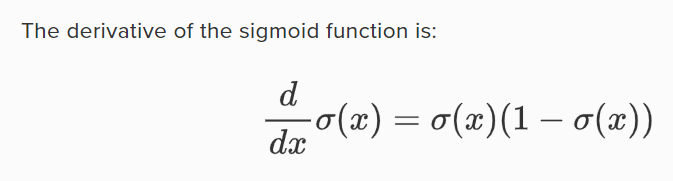 

Plot of Sigmoid function and it's derrivative:
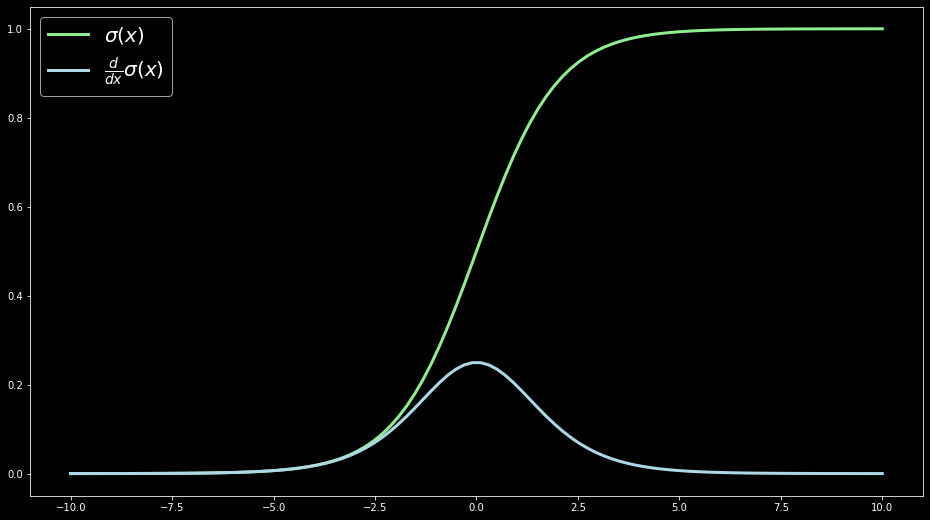
## Advantages
```
Clear prediction either 0 or 1
```


## Disdvantages
```
During backpropagation in deep learning, 
    the gradient of a sigmoid activation function is used to update the weights & biases of a neural network. 
    If these gradients are tiny, the updates to the weights & biases are tiny and the network will not learn.
    
Say the sigmoid AF is used in every layer then it encounters 'Vanishing Gradient problem'

The Range of Derivative of Sigmoid Function is [0, 0.25] which is less.

In Multi Layer network having sigmoid AF 
    Based on chain of derivatives rule 
        The product of multiple derivates which are small values will result in a smaller value.
```
```
Prone to 'Vanishing gradient problem'
```

```
Function output is not 'Zero Centered' --> which is required for efficient weight updation
```

---

# Tanh Activation Function
 ```
    The range of the tanh function is from (-1 to 1).
    The range of it's derivative is from [0 to 1].
 ```
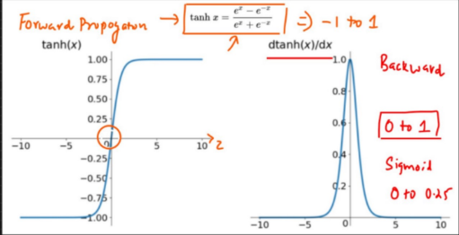
## Advantages
```
Zero Centered
```
## Disdvantages
```
Time Complexity to calculate derivatives --> It makes sense when we take a look at equation tanh(z)

'Vanishing gradient problem' may happpen for deep networks
```

---
# ReLU Activation Function
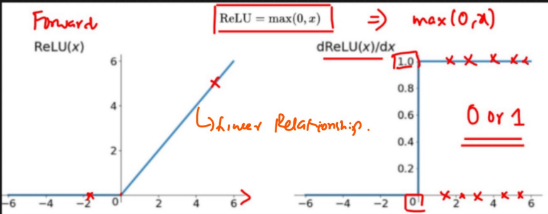
## Advantages
```
Less time complexity -->Faster than sigmoid and tanh and has linear relationship
```
## Disdvantages
```
Negative Data points are considered as zero.
Not Zero Centered
When the derevative is zero it leads to dead neuron --> because there is no updation in weights
```

---

# Leaky RELU / Parametric RELU Activation Function
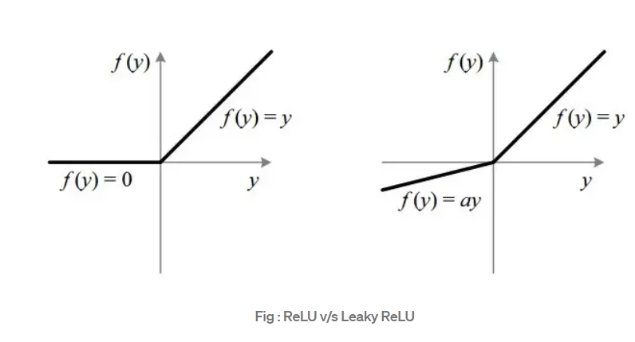
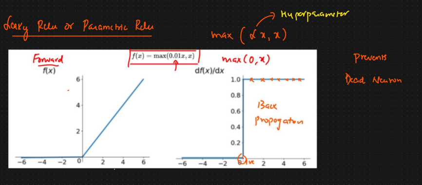
if alpha = 0.01 then it is Parametric RELU else it is called Randomised ReLU
## Advantages
```
It prevents the dead neuron --> the derivative never becomes zero.(based on alpha the value changes to nearly zero but never becomes zero.
```

# ELU (Exponential Linear Units)
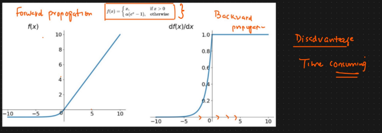
## Advantages
```
It is Zero Centered
It avoids Dead neuron
```


# For multiclass classification we use `Softmax Activation Function`
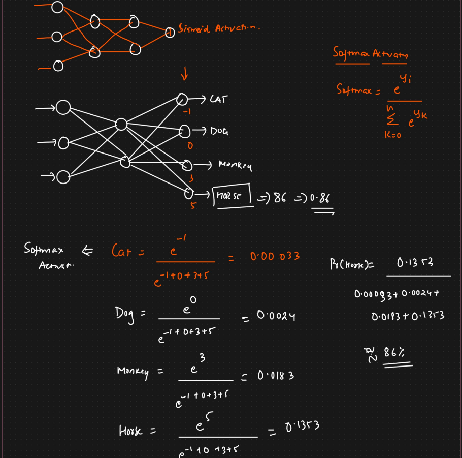


----
# Which Activation Function do we need to use and when?
```
For hidden layers we need to use RELU and it's variants
For output layer 
    if it has one neuron use sigmoid AF.
    if it has multiple neurons use softmax AF
```


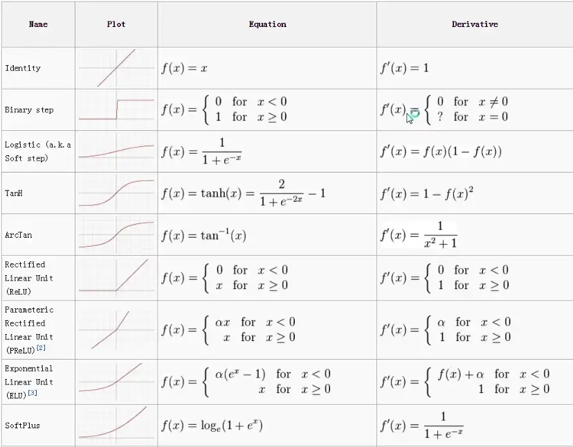
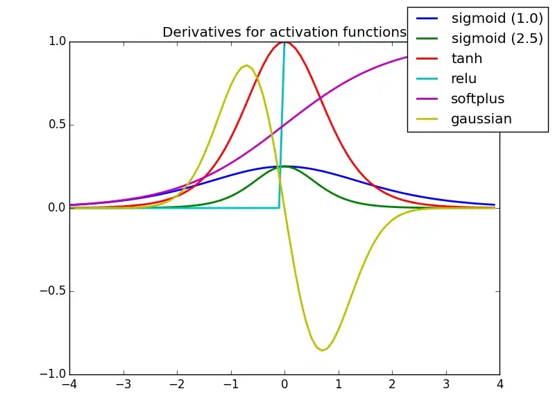