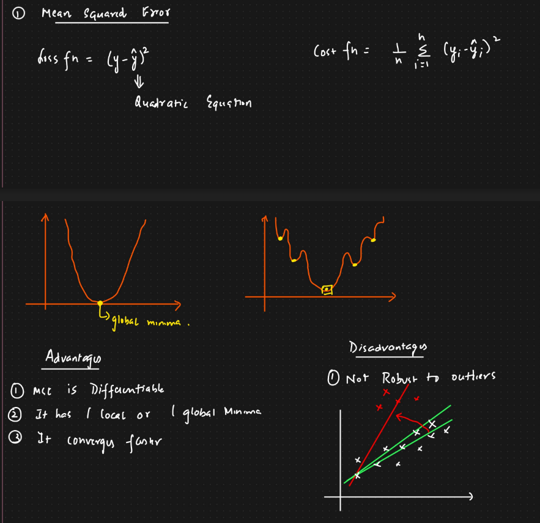
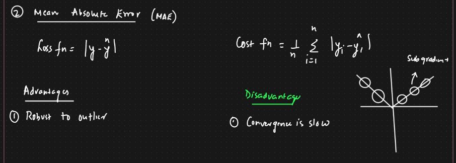
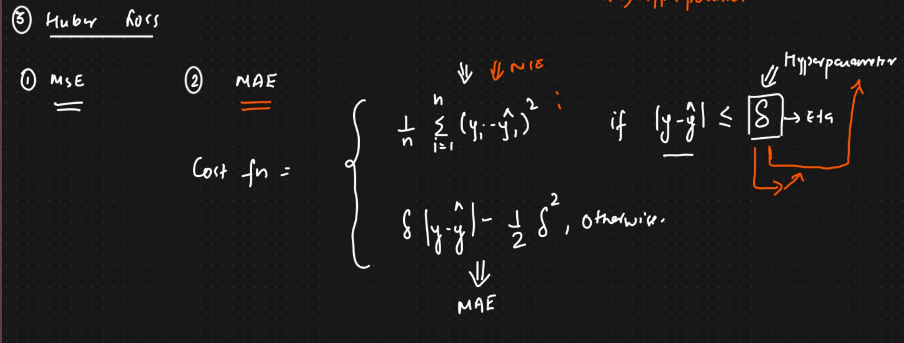
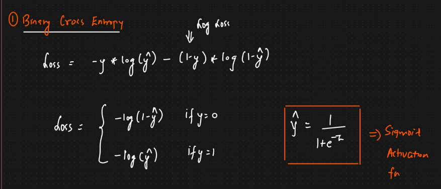
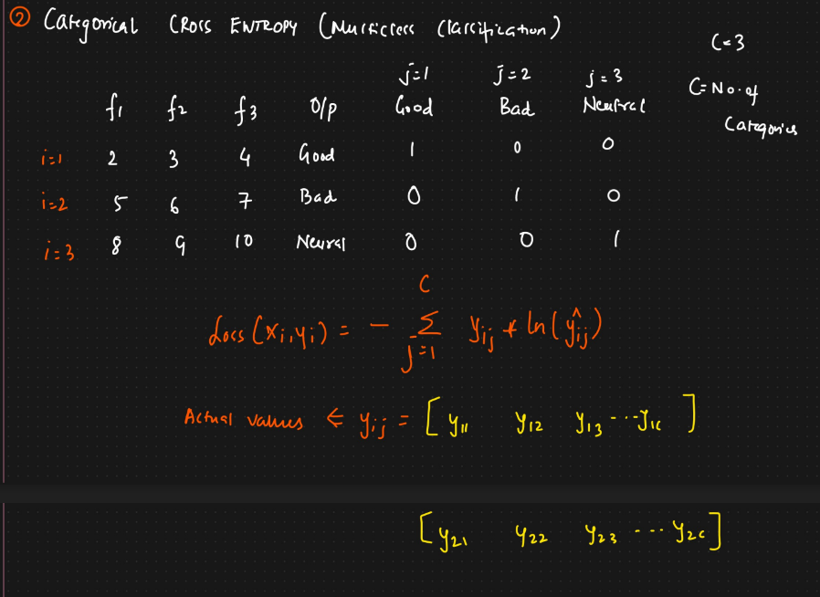
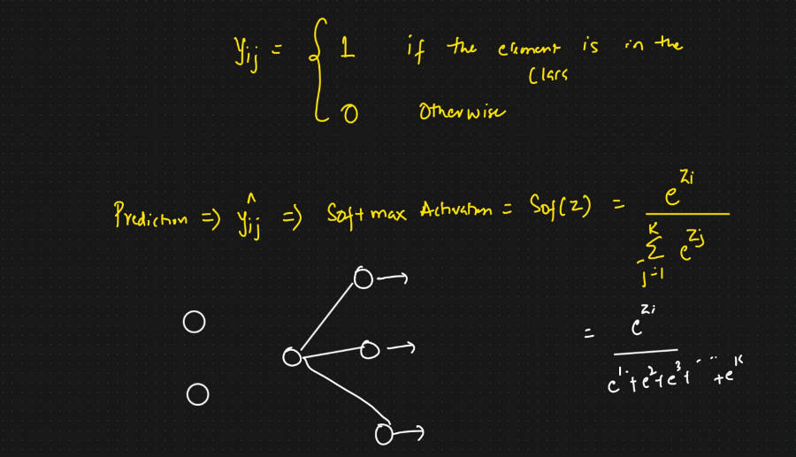
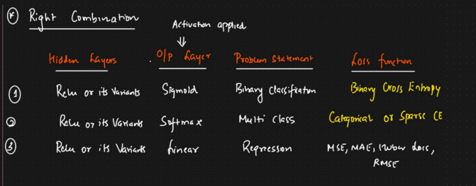

ANN is used to solve Classification and Regression problems

# Cost functions for Regression Problems:
```
MSE
MAE
Huber Loss
RMSE
```
# MSE


# MAE


# Huber Loss
```It is combination of MSE and MAE```


# Loss and Cost Function for Classification problem
```
Cross Entropy ==> What is it?

Binary Cross Entropy
Categorical Cross Entropy ==> For Multiclass
Sparse Categorical Cross Entropy ==> For Multiclass
```
# Binary Cross Entropy


# Categorical Cross Entropy



# Sparse Categorical Cross Entropy
```It just chooses the class with highest value in o/p```



