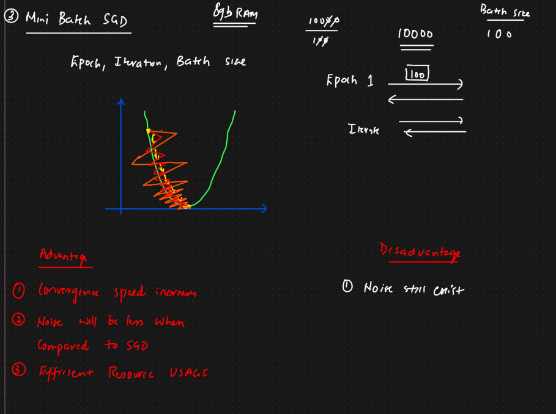

# Various Optimizers
```
    Gradient Descent
    Stochastic Gradient Descent (SGD)
    Mini Batch SGD
    SGD with momentum
    ADA Grad and RMS prop
    ADAM optimizer
```
# Epoch : 
# Iterarion :


---

# Gradient Descent Optimizer


```
Here in an epoch we send all data points at once and back propogate 
In the same way we continue till n epochs untill we minimize the cost function.

DisAdvantage:
    As we are processing all data points at once parallely we need machines with huge RAM and GPU.

So to avoid this requirement for intensive resources we get into SGD
```
---


# Stochastic Gradient Descent (SGD)

```
Here in an epoch during an iteration 1 data point is sent and back propogated.
Thus it performs multiple iterations in a single epoch till all the data points are sent and back propogated individually.

Multiple epochs are performed similarly till we get minimum Cost Function.

DisAdvantage:
    The Convergence will take time.
    Noise will get introduced ==> the movement seen in gradient descent graph above is noise.(no smooth convergence)
    
```


---
# Mini Batch Stochastic Gradient Descent

To Avoid disadvantages like resource intensive, slow convergence together we get into this.
```
Here we send data in a batch instead of sending individual or all at once.
In an epoch for a given iteration we send batch of records and for each iteration we send batches of data.
```
---

# SGD with Momentum

