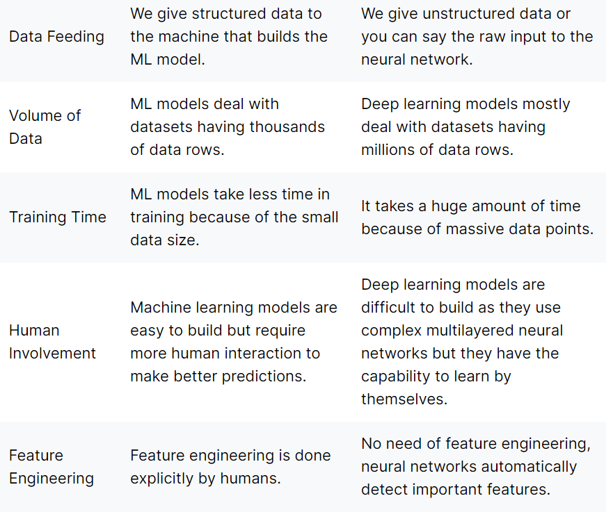
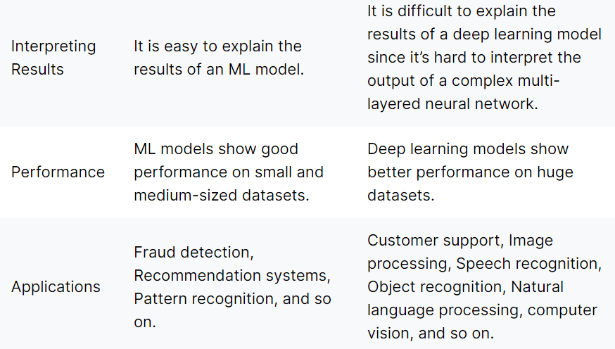
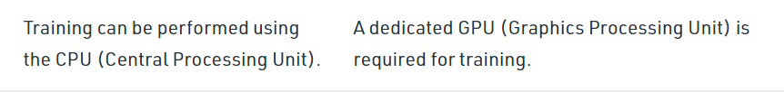
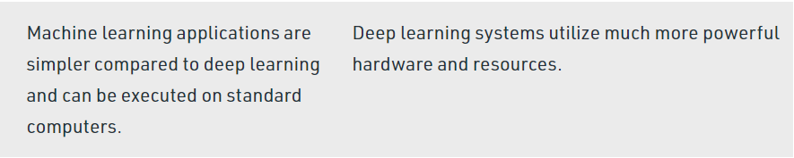
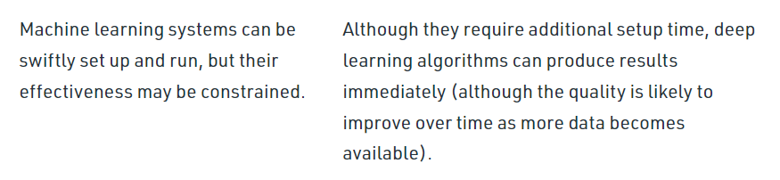
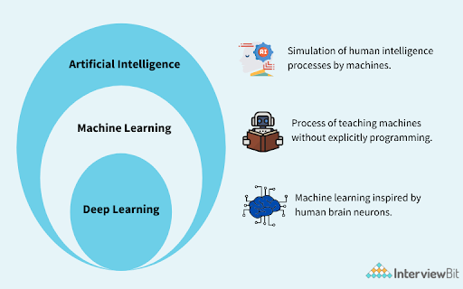
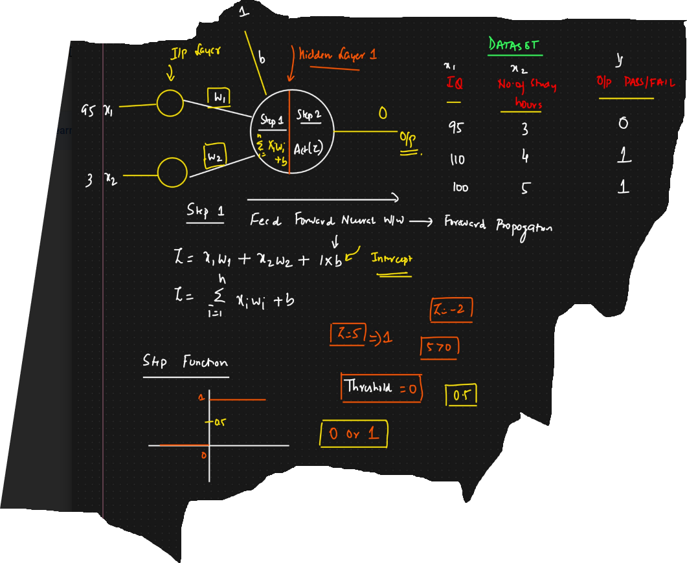
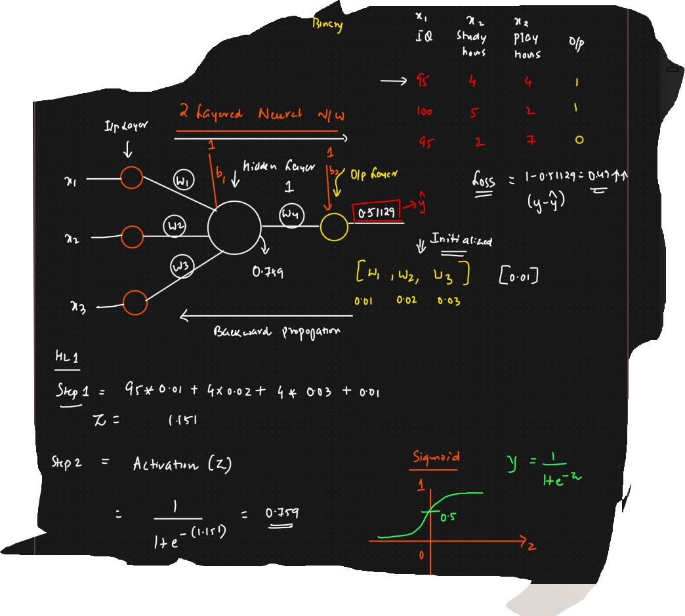
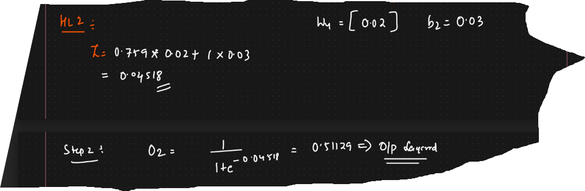

# ML Vs DL





```
Deep learning algorithms heavily depend on high-end machines, contrary to traditional machine learning algorithms, which can work on low-end machines. 
This is because the requirements of deep learning algorithm include GPUs which are an integral part of its working. 
Deep learning algorithms inherently do a large amount of matrix multiplication operations. 
These operations can be efficiently optimized using a GPU because GPU is built for this purpose.
```
---
---
# Limitations of Machine Learning?
```
    1.ML models are not capable of doing feature engineering by themselves.  ==> Try to write an explanation?
        * In machine learning, feature engineering is done by humans explicitly but in deep learning, it is done by the model itself without human intervention.
        
    2.Machine learning algorithms cannot solve complex AI problems like Natural Language Processing, Image Recognition, etc.
    3.ML models do not perform well with very large datasets.  
```
---
---
# How Does Deep Learning work?
```
 Deep learning is implemented through Deep Neural Networks. 
 The idea of neural networks is totally based on neurons of the human brain. 
 Here we just give the raw input to a multilayer neural network and it does all the computation. 
 Featuring engineering is done automatically by this artificial neural network by adjusting the weightage of each input feature according to the output. 
```

```
* The first layer of a neural network is called the input layer and 
  the last layer is known as the output layer. 
* All the other layers between input and output are known as hidden layers. 
* A neural network can have any number of hidden layers.
 
* Each layer of the neural network consists of a bunch of neurons. 
* At neurons the actual data processing takes place. 

* The information is transferred from one layer to another layer via weighted channels.
* These channels transform the input data within the hidden layers. 
* The input gets multiplied with the weight value of the channel and then output is passed to the next layer. 
* On getting the information from the previous layer, current layer neurons get activated and start their processing. 
* During this whole process weights of each channel are continuously adjusted in order to give the best results. 
```

# What is Deep Learning?
```
    * Deep learning is a branch of machine learning 
      where the machine learn in a similar way to that of a human brain. 
                                    (or)
      which is completely based on artificial neural networks, as neural network is going to mimic the human brain
```



### ANN = Artificial Neural Network
```
    we can solve classification and regression for tabular data
```

### CNN = Convolution Neural Network
```
    image classification is done using CNN with help of pixels
    input is in the form of video frames or images
    
    Advanced models of cnn: RCNN,Detectron,YOLO V6,V8
```

### RNN = Recurrent Neural Network
```
    input is of type text or time series data
    
    eg: LSTM RNN, RNN GRU, Bidirectional LSTM, Encoder Decoder, Transformers, BERT, Attention Models
```
---
# We use Pytorch and TensorFlow (KERAS is part of TensorFlow) to solve problems

---

# Why Deep Learning? Why is it so popular?
```
    * In 2005 because of social media like Facebook came into existence.
    * The data started to generate. 
    * Now the question raised how to store data efficiently? --> this is answered by hadoop and various others
    * Now another question like 'How to use the data to make the product better?' --> Data Science.
    * GPU (hardware requirements) cost was less.
    * Huge amount of data is generated --> Deep learning models performs well.
```    
# Applications
```
medical --> prediction of bone cracks, diseases.
```
---

# `Perceptron` [Artificial Neuron or neural network unit] 
```
    Single layer neural network
    Used to solve linear seperale binary classification.
    Feed Forward Neural Network --> Forward Propogation
```
```
    input layer
    hidden layer
    weights
    Activation function
    Bias
    Output layer
```


```
In the above image we can see that equation of z is similar to equation of y in multiple linear Regression
So this is the reason perceptron is used to solve linearly seperable binary classificaton.

```
---
# What is Feed Forward Neural Network and What is Forward Propagation?

---

# Multi layered Neural Network [ANN]
```
    Forward Propogation
    Backward Propogation
    Loss Function
    Activation Function
    Optimizers
```


```
It uses Backward propogation to update weights
For Backward propogation the weight updation formula is achived by optimisers

```
    
